# An Express server for finding your way around CORS #

This tutorial was inspired by a group of students who were building a frontend and a backend for their first full-stack project. They wanted to deploy the backend to [a site that offers free hosting](https://render.com/pricing) for hobbyists, students, and indie hackers. And they wanted to prevent anyone else from obtaining resources from their backend.

They knew that CORS, or [Cross-Origin Resource Sharing](https://developer.mozilla.org/en-US/docs/Web/HTTP/CORS) is a mechanism that allows your server to whitelist or blacklist which sites can access the resources on your site. But CORS wasn't working the way they had assumed it would work.

They discovered an issue when they deliberately made a request from an unauthorized origin. Their CORS code was apparently refusing the request, which is good, but their database was being queried all the same. Which was not what they wanted. 

> **Use cases for CORS**  
> You can use CORS to:
> * Prevent third-party sites from hot-linking to your images, videos, fonts and other resources
> * Decide which sites can have read data from your server's API

### Goals
In this tutorial, you will be setting up a basic Express server and getting to respond nicely to requests from a source that can be trusted, and to refuse to allow your browser to use information obtained by sources which have not been whitelisted.

You'll see how you can dive into the code of the `cors` Node module itself, and emerge with a deep understanding of what the `cors` module does... and what it does not do.

And finally, you'll see how to block sites from getting any information from your server, unless they have been whitelisted.

### Who this tutorial is for

Before you start this tutorial, you should be comfortable with JavaScript in general and the [Express Node module](https://expressjs.com/) in particular. You should know [how to access the Developer Tools](https://balsamiq.com/support/faqs/browserconsole/) in your favourite browser. You should also understand a few basic `bash` commands including those used with `npm`. It helps if you know how to use [Promises](https://developer.mozilla.org/en-US/docs/Web/JavaScript/Reference/Global_Objects/Promise) and the [fetch API](https://developer.mozilla.org/en-US/docs/Web/API/Fetch_API/Using_Fetch), but you can skip over this code without losing the thread.

In the `optionalCallbackForListen()`, in Listing 2 below, I have used some more advanced code, simply to make your life easier. This should "just work" even if you don't fully understand it.

### Source code

The [GitHub repository](https://github.com/MERNCraft/CORS-backend) for this tutorial has two branches: `main` and `invitation-only`. If you clone the repository, you will need to run `npm install` before you can use `npm start` to run the server.

The second branch contains an updated version of `main` that is used in the second part of the tutorial.

> **NOTE**  
> There is a section on using a debugger to step through the source code of the `cors` Node Module. I'll be using [Visual Studio Code](https://code.visualstudio.com/download) as my code editor, so the steps and the screenshots that provide will refer to the [VS Code debugger](https://code.visualstudio.com/docs/editor/debugging).
> If you use a different development environment, I encourage you to follow using the debugger that you are used to. However, you don't _need_ to use a debugger at all to follow the explanations about how `cors` works; you can simply work through my explanations of the code.

## A. Setting up a bare-bones Express server

Here are the steps that you need to create a very basic Express server, and check that it is working as expected.

1. Start a project folder for the backend  
   `mkdir backend && cd backend && npm init -y`
2. Install the run-time dependencies  
   `npm install express cors`
3. Install nodemon as a dev dependency, to restart the server
   whenever any changes are made  
   `npm install --save-dev nodemon`
4. Add `"start": "nodemon app.js",` to "scripts" section of `package.json`, which should now look something like this:

```json
{
  "name": "backend",
  "version": "1.0.0",
  "description": "",
  "main": "index.js",
  "scripts": {
    "start": "nodemon app.js",
    "test": "echo \"Error: no test specified\" && exit 1"
  },
  "keywords": [],
  "author": "",
  "license": "ISC",
  "dependencies": {
    "cors": "^2.8.5",
    "express": "^4.18.2"
  }
}
```
<small style="color:orange">Listing 1</small>

5. Create a file named `app.js` with the following script:
```javascript
const PORT = 3000

// Initialize the Express app
const express = require('express')
const app = express()


app.get('/', (req, res) => {
  // Respond to a request with a timed message giving
  // the URL to where the server received the request
  const { protocol, hostname } = req
  const message = `<pre>
Connected to ${protocol}://${hostname}:${PORT}
${Date()}
</pre>`

  res.send(message)
})


app.listen(PORT, optionalCallbackForListen) 


//Print out some useful information in the Terminal
function optionalCallbackForListen() {
  // Check what IP addresses are used by your 
  // development computer.
  const nets = require("os").networkInterfaces()
  const ips = Object.values(nets)
  .flat()
  .filter(({ family }) => (
    family === "IPv4")
  )
  .map(({ address }) => address)

  // ips will include `127.0.0.1` which is the
  // "loopback" address for your computer. This
  // address is not accessible from other
  // computers on your network. The host name
  // "localhost" can be used as an alias for
  // `127.0.0.1`, so you can add that, too.
  ips.unshift("localhost")

  // Show in the Terminal the URL(s) where you
  // can connect to your server  
  const hosts = ips.map( ip => (
    `http://${ip}:${PORT}`)
  ).join("\n  ")
  console.log(`Express server listening at:
  ${hosts}`);
}
```
<small style="color:orange">Listing 2</small>

6. In the Terminal, run `npm start`. You should see something like this:
<pre style="background-color:#333">Express server listening at:
  http://localhost:3000
  http://127.0.0.1:3000  
  http://192.168.0.11:3000</pre>
<small style="color:orange">Listing 3</small>

> **Note**  
> You should see at least the first two entries in this list. You will see more entries if you have a connection to a network, via Wi-Fi or an Ethernet (RJ45) cable. The IP address of any of these additional entries is likely to be different from what is shown above. 

7. Ctrl-click or Cmd-click on a link to open your browser. You should see something like this:
<pre style="background-color:#333">Connected to http://192.168.0.11:3000 
Wed Feb 21 2024 10:54:05 GMT+0200 (Eastern European Time)</pre>

The hostname and port number will depend on your network, on your choices, and on which link you clicked on.

> **NOTE**  
> The links to [http://localhost:3000](http://localhost:3000) and [http://127.0.0.1:3000](http://127.0.0.1:3000) will only work from the same computer where the server is running. If you see any other links, then you can connect to these from any other device on your network. In my case, for example, I can use the browser on my smartphone to connect to http://192.168.0.11:3000, and I will see the result shown above.

## B. Inspect the `headers` in the request

When your browser connects to a server, its request contains a lot of information. The server needs this information to work out what to send in response. If the request seems to come from an untrustworthy source, the server should send a response indicating that it refuses to send what was requested.

Here's how you can see what _headers_ have been sent to the server by the browser:

8. Add a new _route_ to the `app.js` script:
```javascript
app.get('/headers', (req, res) => {
  const message = `<pre>
${JSON.stringify(req.headers, null, "  ")}
</pre>`

  res.send(message)
})
```
<small style="color:orange">Listing 4</small>

Because you are using `nodemon` to run `app.js`, the server will restart immediately after you save your changes. Any new requests made to the server will apply the new code.

9. In the address bar of your browser, add `/headers` after the root URL for the server. The address should look something like...  
   `http://192.168.0.11:3000/headers`  
... but the actual hostname will depend on the link that you chose to click on.
10. When you visit this URL, you should see something like this in your browser...
```json
{
  "host": "192.168.0.11:3000",
  "user-agent": "Mozilla/5.0 (Macintosh; Intel Mac OS X 10.15; rv:122.0) Gecko/20100101 Firefox/122.0",
  "accept": "text/html,application/xhtml+xml,application/xml;q=0.9,image/avif,image/webp,*/*;q=0.8",
  "accept-language": "en-GB,en;q=0.7,en-US;q=0.3",
  "accept-encoding": "gzip, deflate",
  "dnt": "1",
  "sec-gpc": "1",
  "connection": "keep-alive",
  "upgrade-insecure-requests": "1",
  "if-none-match": "W/\"1f8-tKI1cj2bpbkgxIdZM72V7n0xKOs\""
}
```
<small style="color:orange">Listing 5</small><br>  
... and possibly some other headers.

For more details, see [here](https://developer.mozilla.org/en-US/docs/Glossary/Request_header).

> **ASIDE**  
> The `req` object does not have a property of its own called `headers`. So where does `req.headers` come from?
> 
> Express is built as a wrapper for Node's built-in [`http`](https://nodejs.org/api/http.html) module. Express creates the `req` object as an instance of the native [http.IncomingMessage](https:\/\/nodejs.org/api/http.html#class-httpincomingmessage) class.
> See node_modules/express/lib/request.js:
> ```javascript
> var req = Object.create(http.IncomingMessage.prototype)
>```
> The value for `req.headers` is provided by the [`headers`](https://nodejs.org/api/http.html#messageheaders) property of the `IncomingMessage` prototype.


## C. Use your browser's Developer Tools to inspect the headers

To be honest, you didn't actually need to create a separate `/headers` route to deliver the request headers to your browser. You can find this information through the Developer Tools in your browser itself.

11. Open the Developer Tools of your browser and activate the Network tab. 
12. Ensure that the All button (at the left of the line of data type buttons near the top) is selected
13. You should see a table containing a list of requests that your browser has made to the server
14. Click on the Domain or Name column, to open a pane where you can choose to select the Headers tab.
15. If necessary, click on the disclosure triangles for Response Headers and Request Headers, so that all headers are visible.

Here is a screen shot from Google Chrome. The display in your browser may be different.

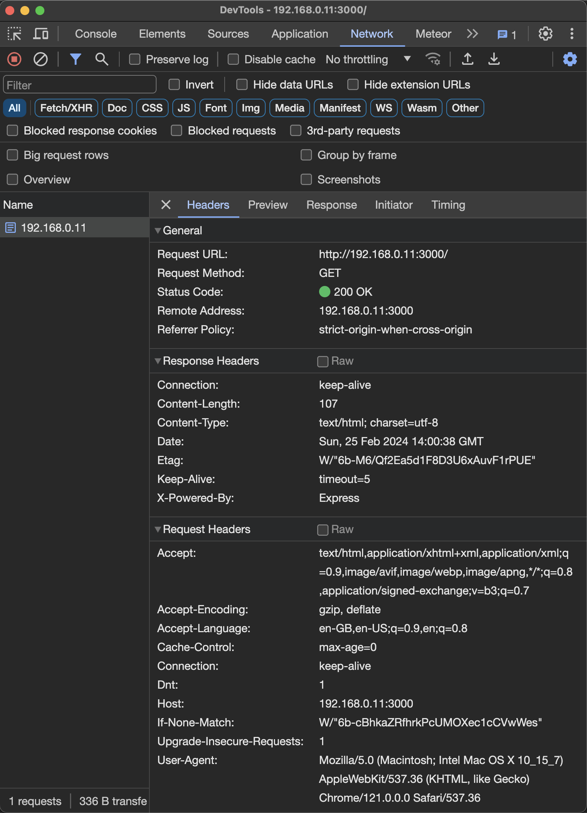
<small style="color:orange">Figure 1</small>  

### The curious incident of the `origin` key in `req.headers`

As you may already know, the `cors` module uses the value of `req.headers.origin` to decide what action to take. But as you can see, there is _no_ entry with the key [`origin`](https://developer.mozilla.org/en-US/docs/Web/HTTP/Headers/Origin), either in the `req.headers` object that is displayed in your browser window or in the Network tab of the Developer Tools.

This is because your request is made directly from the address bar of your browser. The browser considers that any direct request like this is innocent, and thus trustworthy, so it doesn't send an `origin` header.

If there _were_ a value for `req.headers.origin` it would have a value with one of these formats:

```
<scheme>://<hostname>
<scheme>://<hostname>:<port>
```
Here are some examples of what `req.headers.origin` could look like:
```
https://192,168.0.42
https://www.example.com
http://example.com:3000
```

The lack of an entry for `origin` indicates that the browser considers that the request is for a resource from the _same site_, and so it the request can be trusted.

## D. Same-Origin and Cross-Origin Requests

So an important question is: **What is the simplest way to connect to your server from a potentially *untrustworthy* origin?**. In technical terms: how do you make a _cross-origin request_?

The quickest way to do this is to visit a site (any site) and make a request from your browser _Console_ rather than from the address bar. This will make the browser send the request _as if it came from the site that is currently displayed_.

Before sending a _cross_-origin request, you might want to see how this process will work for a _same_-origin request.

16.  In your browser, visit [http://localhost:3000/headers](http://localhost:3000/headers). You should see in your browser the same details that are given in Listing 5 above.
17.  Open the Developer Console in your browser and paste in the following code:

```javascript
options = {"method": 'GET', "Content-Type": 'application/json'};
fetch('http://localhost:3000/headers', options)
.then(res => res.text())
.then(text => console.log(text))
.catch(error => console.log("Error", error))
```
<small style="color:orange">Listing 6</small>  

> **NOTE**  
> If you understand this code, and the way it uses [Promises](https://developer.mozilla.org/en-US/docs/Web/JavaScript/Reference/Global_Objects/Promise), great! If not, you can just think of it as a black box that does something useful for you, and you can learn about how it works later.
> 
> The one important point to note is the use of the `GET` method, as this will come up again later.

18. Press the Enter key.

The code that you pasted requests the exact same page as from the same server as the page you are visiting. Your browser will understand this, and send the appropriate headers. As a result, you should see something like this (complete with the `<pre>` and `</pre>` tags):

<pre>
&lt;pre&gt;
{
  "host": "localhost:3000",
  "user-agent": "Mozilla/5.0 (Macintosh; Intel Mac OS X 10.15; rv:122.0) Gecko/20100101 Firefox/122.0",
  "accept": "*/*",
  "accept-language": "en-GB,en;q=0.7,en-US;q=0.3",
  "accept-encoding": "gzip, deflate, br",
  <b style="color:orange">"referer": "http://localhost:3000/headers",</b>
  "dnt": "1",
  "sec-gpc": "1",
  "connection": "keep-alive",
  <b style="color:orange">"sec-fetch-dest": "empty",
  "sec-fetch-mode": "cors",
  "sec-fetch-site": "same-origin"</b>
}
&lt;/pre&gt;
</pre>
<small style="color:orange">Listing 7</small>

(The bold orange styling is mine.)

### What's new?

* There is an entry for `"referer"`, which shows the page that was open when you sent the request: [http://localhost:3000/headers](http://localhost:3000/headers).

_And, yes: `referer` is a spelling mistake. This mistake was made in the original specifications, so it has become part of the standard. That's the way it is now. You may be familiar with the [`noreferrer` HTML attribute]([Attributes](https://developer.mozilla.org/en-US/docs/Web/HTML/Attributes/rel/noreferrer)) or the [`Referrer-Policy` header](https://developer.mozilla.org/en-US/docs/Web/HTTP/Headers/Referrer-Policy).  is spelt correctly._

Also there are three new properties whose names begin with "sec-fetch-":

* "[sec-fetch-dest](https://developer.mozilla.org/en-US/docs/Web/HTTP/Headers/Sec-Fetch-Dest)": "empty",
* "[sec-fetch-mode](https://developer.mozilla.org/en-US/docs/Web/HTTP/Headers/Sec-Fetch-Mode)": "cors",
* "[sec-fetch-site](https://developer.mozilla.org/en-US/docs/Web/HTTP/Headers/Sec-Fetch-Site)": "same-origin"

You can follow the links for the different properties to find an explanation of what they mean and what they do.

But there is still no `origin` property.

This test shows that your browser will tell the server which page made the request, and whether this page has the `same-origin` as the data that is being requested.

## E. Making a Cross-Origin Request

As you saw in step 6, you can connect to your server through at least two different URLs. What happens if you try to access the server at one URL through a page that was served from the other?

19. With your browser's Developer Console active, press the Up arrow on your keyboard. This will read the last command from the Console's history and paste it back into the Console.

20. Change just the hostname from `localhost` to `127.0.0.1`, as shown below:

```javascript
options = {"method": 'GET', "Content-Type": 'application/json'};
fetch('http://127.0.0.1:3000/headers', options)
.then(res => res.text())
.then(text => console.log(text))
.catch(error => console.log("Error", error))
```
<small style="color:orange">Listing 8</small>

21.  Press the Enter key.

This time, depending on which browser you are using, you should see something like this in the Console:

<pre>
▶ <span style="color:#99f">Promise { &lt;state&gt;: <span style="color:#f69">"pending"</span> }
<span style="color:#f88">Cross-Origin Request Blocked: The Same Origin Policy disallows reading the remote resource (Reason: CORS header ‘Access-Control-Allow-Origin’ missing). Status code: 200.</span>

Error <span style="color:#f88">TypeError: NetworkError when attempting to fetch resource.</span>
</pre>
<small style="color:orange">Listing 9</small>

Whatever browser you are using, the message should tell you that there is no `‘Access-Control-Allow-Origin’` CORS header set. And instead of logging the expected `req.headers` data, the operation triggers an error.

What does this mean?

It means that, by default, your server will refuse to serve any data to a web page on a site where the hostname of the site's server is not the same as the hostname from which the data is requested. And this is true, even when it is _exactly the same server app_ that is accessible through two different host names.

## F. Allowing Cross-Origin Resource Sharing

Back in step 2, you installed a Node module called `cors`, but you haven't used it yet.

22. Add this code to your `app.js` file, just after the line that says: `const app = express()`

```javascript
const cors = require('cors')

const corsOptions = {
  origin: (origin, callback) => {
    console.log("origin:", origin);
    callback(null, true)
  }
}

app.use(cors(corsOptions))
```
<small style="color:orange">Listing 10</small>

I'll go deeper into what this code does in section G below.

The complete code in the `app.js` file should look like this now:

```javascript
const PORT = 3000

// Initialize the Express app
const express = require('express')
const app = express()
const cors = require('cors')

const corsOptions = {
  origin: (origin, callback) => {
    console.log("origin:", origin);
    callback(null, true)
  }
}

app.use(cors(corsOptions))


app.get('/', (req, res) => {
  // Respond to a request with a timed message giving
  // the URL to where the server received the request
  const { protocol, hostname } = req
  const message = `<pre>
Connected to ${protocol}://${hostname}:${PORT}
${Date()}
</pre>`

  res.send(message)
})


app.get('/headers', (req, res) => {
  const message = `<pre>
${JSON.stringify(req.headers, null, "  ")}
</pre>`

  res.send(message)
})


app.listen(PORT, optionalCallbackForListen) 


//Print out some useful information in the Terminal
function optionalCallbackForListen() {
  // Check what IP addresses are used by your 
  // development computer.
  const nets = require("os").networkInterfaces()
  const ips = Object.values(nets)
  .flat()
  .filter(({ family }) => (
    family === "IPv4")
  )
  .map(({ address }) => address)

  // ips will include `127.0.0.1` which is the
  // "loopback" address for your computer. This
  // address is not accessible from other
  // computers on your network. The host name
  // "localhost" can be used as an alias for
  // `127.0.0.1`, so you can add that, too.
  ips.unshift("localhost")

  // Show in the Terminal the URL(s) where you
  // can connect to your server  
  const hosts = ips.map( ip => (
    `http://${ip}:${PORT}`)
  ).join("\n  ")
  console.log(`Express server listening at:
  ${hosts}`);
}
```
<small style="color:orange">Listing 11</small>

23. In the Developer Console for the page served by `localhost`, rerun your last command, which made a request to `127.0.0.1`. This time, your request should succeed, and you should see the data that you expect from `req.headers`, which should look something like this ():

<pre>
▶ <span style="color:#99f">Promise { &lt;state&gt;: <span style="color:#f69">"pending"</span> }</span>
&lt;pre&gt;
{
  "host": "127.0.0.1:3000",
  "user-agent": "Mozilla/5.0 (Macintosh; Intel Mac OS X 10.15; rv:123.0) Gecko/20100101 Firefox/123.0",
  "accept": "*/*",
  "accept-language": "en-GB,en;q=0.7,en-US;q=0.3",
  "accept-encoding": "gzip, deflate, br",
  <span style="color:#ffc">referer": "http://localhost:3000/",</span>
  <b style="color:orange">"origin": "http://localhost:3000",</b>
  "dnt": "1",
  "sec-gpc": "1",
  "connection": "keep-alive",
  <span style="color:#ffc">"sec-fetch-dest": "empty",
  "sec-fetch-mode": "cors",
  "sec-fetch-site": </span><b style="color:orange">"cross-site",</b>
  "if-none-match": "W/\"1e8-AvXgPd5sDM9iBxxmm97LaXmXJ+4\""
}
&lt;pre&gt;
</pre>


### What's new this time?

When you made a request to `localhost` from a page served by `localhost`:
* There was no `"origin"` entry in `req.headers`. There is now, and its value is `"http://localhost:3000"`.
* The value for `"sec-fetch-site"` was `"same-origin"`. Now it is `"cross-site"`.

If you look in the Terminal where you started your server, you should see a new item that has been logged:

```bash
origin: http://localhost:3000
```

This was caused by the code that you have just added (see Listing 10).

## G. Discovering what the `cors` Node module does

There are easier ways of using the `cors` module than the code I have used here, but this technique allows you to look under the hood at what the module is actually doing.

### Using the Debugger

> **NOTE**  
> If you are using [Visual Studio Code](https://code.visualstudio.com/download) as your code editor, you can follow the exact steps I give below. If you are familiar with using the debugger in a different environment, you may have to adjust the steps to suit.
> 
> If you are not using VS Code and the whole concept of debugging a script alarms you, no worries. You can just follow along by reading the chunks of `cors` code that I give below.

Before you can use the debugger to inspect the code used by your server app, you will need to stop the server.

24.  Click on the Terminal where your ran `npm start` earlier to give it keyboard focus, and then type `Ctrl-C` to stop the server. You should see `^C` on one line and the white insertion caret on the next, indicating that the Terminal is currently not doing anything.

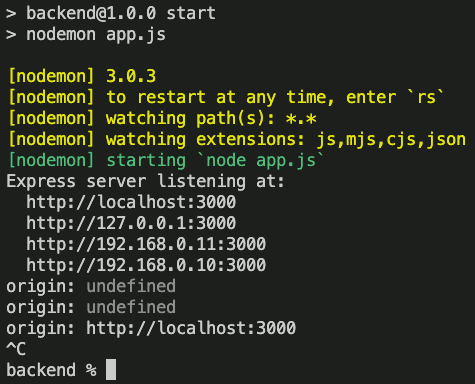  
<small style="color:orange">Figure 2</small>  

25. In VS Code, open the `app.js` file and click just to the left of the line number for the line `callback(null, true)`. A red dot should appear to indicate that you have set a debugger breakpoint.

26. Open the Debug Console pane in place of the Terminal pane
27. Select Run > Start Debugging (or press the `F5`‡ key on your keyboard)

> *‡ Depending on how your keyboard is set up, you may need to press the `fn` key at the same time as you press `F5`. If so, you will need to press `fn` at the same time as you press any of the `F` keys in the instructions below.*

The composite image below illustrates these steps:

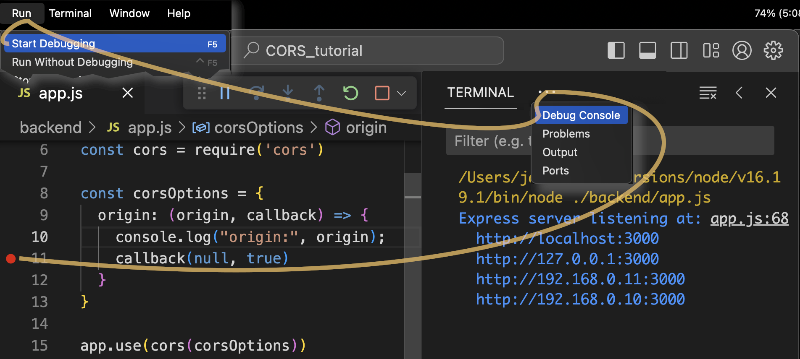  
<small style="color:orange">Figure 3</small>  

1.   In the Developer Console in your browser, press the Up arrow and then the Enter key, to send the last command again.

The VS Code window should now be brought to the front. As in Figure 4 below, you should see that:
* There is a little yellow arrow around the red debugger breakpoint that you set in step 25. This indicates that this line has not yet been executed.
* The line `callback (null, true)` is highlighted.
* The Debug Console shows a new line: <code style="color: #19F">origin: http://localhost:3000</code>, because the line `console.log("origin:", origin)` has just been executed.
* The Control Panel for the debugger has been updated. It now shows active arrow buttons for Continue, Step Over, Step Into and Step Out.

  
<small style="color:orange">Figure 4</small>  

29. Click on the Step Into button (or press F11).
  
This will take you into the code of the `cors` module, where you can follow step-by-step what `cors` does.

> **NOTE**  
> If you are simply reading this article without following the debugging steps, you can open `backend/node_modules/cors/lib/index.js` and look for the code that is shown below. 

  
<small style="color:orange">Figure 5</small>  

On the left, of the VS Code window, you will see a panel that shows the value of the variables that are available in the current scope. Specifically, in the "Local" section at the top, you can see that a custom `err2` variable has the value `null` and the variable `origin` has the value `true`. This is the value that you gave to the second argument of the call to `callback` in your `app.js` file.

You can click on the disclosure arrow for the first "Closure" entry to see the value of the `corOptions` object. You created this object in the `app.js` file, and gave it a property called `origin` whose value is a function. Here you can seen that function displayed.

Since then, the `cors` module has been busy adding other properties (like `err2`). The call you made from the browser Console explicitly used the method `GET`, which is one of the methods that the `corsOptions` object lists in its `methods` property. You'll see in a moment why this matters.

### Calling `cors`

The expression `err2 || !origin` is falsy, so the following lines will be executed:

```
corsOptions.origin = origin;
cors(corsOptions, req, res, next);
```
<small style="color:orange">Listing 12</small>

30. Get ready to press the Step Into button in the Control panel again, and focus your attention on the value of `corsOptions.origin` in the Variables pane.
31. Press the Step Into button.

Did you see that the value of `corsOptions.origin` changes? It changes from being the function that you created to the result of the callback used by that function: `corsOptions.origin` becomes `true`.

32. Press the Step Into button again. The debugger will step into the `cors()` function.

  
<small style="color:orange">Figure 6</small>  

The `corsOptions` object is passed as an `options` variable, so its name has changed but its content is still the same. The `req` and `res` objects that were available to your code in the `app.js` script are also available here.

The `cors()` function:
* Creates an empty array called `headers`
* Reads in the value of `method` from the `req` object and converts it to uppercase. This will be the value `GET` that you set in your call from the browser console, so it was already uppercase.
* Sees that `method` is not `"OPTIONS"`, so it jumps over the first part of the `if ... else` statement, and next it runs the command:
```javascript
headers.push(configureOrigin(options, req));
```
<small style="color:orange">Listing 13</small>

33. Press the Step Into button four more times, so that the debugger steps into the `configureOrigin()` function.

### The `configureOrigin()` function

The `configureOrigin()` function is where `cors` decides whether to accept the request or not. It looks at both the value of `req.headers.origin` and the value for `options.origin`.

In the current case, `req.headers.origin` is `"http://localhost:3000"`, because that's the hostname for the page from which you made the request, and `options.origin` is `true`, because that is the value you gave in the second argument to `callback(null, true)`.

Here's the function for `cors@2.8.5` in full: 

```javascript
function configureOrigin(options, req) {
    var requestOrigin = req.headers.origin,
      headers = [],
      isAllowed;

    if (!options.origin || options.origin === '*') {
      // allow any origin
      headers.push([{
        key: 'Access-Control-Allow-Origin',
        value: '*'
      }]);
    } else if (isString(options.origin)) {
      // fixed origin
      headers.push([{
        key: 'Access-Control-Allow-Origin',
        value: options.origin
      }]);
      headers.push([{
        key: 'Vary',
        value: 'Origin'
      }]);
    } else {
      isAllowed = isOriginAllowed(requestOrigin, options.origin);
      // reflect origin
      headers.push([{
        key: 'Access-Control-Allow-Origin',
        value: isAllowed ? requestOrigin : false
      }]);
      headers.push([{
        key: 'Vary',
        value: 'Origin'
      }]);
    }

    return headers;
  }
  ```
<small style="color:orange">Listing 14</small>

The case for treating `options.origin` when it is `true` is right at the end, so this gives you the chance to review what other values `options.origin` could have.

The [documentation for Express](https://expressjs.com/en/resources/middleware/cors.html#configuration-options) indicates that `origin` can have a variety of different types:
* Boolean
* String
* RegExp
* Array of String or RegExp items
OR
* a function like the one you provided in `app.js` that eventually sets `origin` to one of the four types listed above.

The `configureOrigin()` function considers these types one by one.

### `options.origin` is `false` or `"*"`

```javascript
if (!options.origin || options.origin === '*') {
  // allow any origin
  headers.push([{
    key: 'Access-Control-Allow-Origin',
    value: '*'
  }]);
}
```
<small style="color:orange">Listing 15</small>

> **NOTE**  
> In practice, it seems impossible to get to this point in the code when `options.origin` is falsy (`false`, `undefined`, `0`, `null` or `""`). If you call `cors()` with no arguments, the `cors` script will use the default value of `"*"` for `origin`.
> 
> Look for the line `var corsOptions = assign({}, defaults, options)`, which ensures that if `options` gives no value for `origin` then the value will be provided by ...
> ```javascript
>var defaults = {
>  origin: '*',
>  methods: 'GET,HEAD,PUT,PATCH,POST,DELETE',
>  preflightContinue: false,
>  optionsSuccessStatus: 204
>};
>  ```
> If you use `{ origin: false }`, then the expression highlighted in Figure 5 will evaluate to true, and the whole process that you have just stepped through will be skipped.

The key point to notice here is that if the `origin` is to be allowed, an object with the `key` `'Access-Control-Allow-Origin'` will be added to the `headers` array, together with a `value` that represents the permitted origin.

### `options.origin` is a String

```javascript
else if (isString(options.origin)) {
  // fixed origin
  headers.push([{
    key: 'Access-Control-Allow-Origin',
    value: options.origin
  }]);
  headers.push([{
    key: 'Vary',
    value: 'Origin'
  }]);
}
```
<small style="color:orange">Listing 16</small>

If you had provide a string as the value for `options.origin` in your `app.js` script, then the value for `'Access-Control-Allow-Origin'` would now be set to that specific string. A [`Vary` header](https://developer.mozilla.org/en-US/docs/Web/HTTP/Headers/Vary) is also set to tell the browser that the value of `Origin` had an effect on the response that the server returns.

### `options.origin` is a RegExp, an array or some other value

In the current case, `options.origin` is `true`, so none of the expressions in the `if ... else` statement that deal with strings evaluate to true. As a result, the final part of the `if ... else` statement applies.

```javascript
else {
  isAllowed = isOriginAllowed(requestOrigin, options.origin);
  // reflect origin
  headers.push([{
    key: 'Access-Control-Allow-Origin',
    value: isAllowed ? requestOrigin : false
  }]);
  headers.push([{
    key: 'Vary',
    value: 'Origin'
  }]);
}
```
<small style="color:orange">Listing 17</small>

34. Press the Step Into button a few more times, so that the debugger steps into the `isOriginAllowed()` function. This receives two arguments:
* `origin`, which was read from `req.headers.origin`
* `allowedOrigin`, which was generated by the object that your `app.js` script applied to `cors()`, and which here is `true`.

```javascript
function isOriginAllowed(origin, allowedOrigin) {
  if (Array.isArray(allowedOrigin)) {
    for (var i = 0; i < allowedOrigin.length; ++i) {
      if (isOriginAllowed(origin, allowedOrigin[i])) {
        return true;
      }
    }
    return false;
  } else if (isString(allowedOrigin)) {
    return origin === allowedOrigin;
  } else if (allowedOrigin instanceof RegExp) {
    return allowedOrigin.test(origin);
  } else {
    return !!allowedOrigin;
  }
}
```
<small style="color:orange">Listing 18</small>

This function return `true` if any one of the following is true:
* `allowedOrigin` is an array and if (by recursion) any of the items in the array matches the `req.headers.origin`.
* `allowedOrigin` is a string. This is only possible if the string were one of the items in an array, and so `isOriginAllowed()` has been called recursively.  
**Note that this is a case _insensitive_ match and `req.headers.origin` is all in lowercase. This means that if you had used `["HTTP://127.0.0.1:3000/"]` instead of `true` in `app.js`, the part of the origin in uppercase would make the match fail.**
* `allowedOrigin` is a Regular Expression that matches `req.headers.origin`
* `allowedOrigin` is any other truthy value.

In the current case, `allowedOrigin` is `true` so `isOriginAllowed()` returns `true`.

35. Press the Step Into button until you reach the line `return !!allowedOrigin;`, which returns the value `true`, and find yourself back in the `configureOrigin()` function.

### Adding `'Access-Control-Allow-Origin'` with the value `true`

Back in `configureOrigin()`, the `'Access-Control-Allow-Origin'` header is given either the value read from `req.headers.origin` or `false`, depending on what `isOriginAllowed()` returned.

```javascript
headers.push([{
  key: 'Access-Control-Allow-Origin',
  value: isAllowed ? requestOrigin : false
}]);
```
<small style="color:orange">Listing 19</small>

In this case, `isAllowed` is `true`, so the `value` associated with `'Access-Control-Allow-Origin'` is the origin of the page that made the request, as you can see in Figure 7 below.


<small style="color:orange">Figure 7</small>  

### Setting the response headers

The `configureOrigin()` function populates an array called `headers` and returns this to the `cors()` function that called it.

36. Press the Step Into button a few more times, to step through the `if` statement in the `configureOrigin()`, until you find yourself back in the `cors()` function.
37. You can press the Step Over button twice, to skip the calls to `configureCredentials()` and `configureExposedHeaders()`, which in this case simply add `null` to the `headers` array.

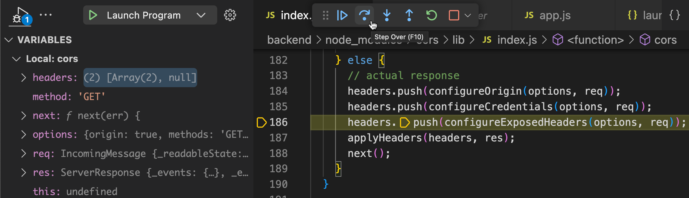
<small style="color:orange">Figure 8</small>  

38. Press the Step Into button again to see what happens inside the `applyHeaders()` function.

### applyHeaders()

The `applyHeaders()` function accepts two arguments:
* Hhe `headers` array that has just been created
* The `res` object which is also available in your `app.js` script.

It iterates through the header array, and calls itself recursively if it finds a sub-array.

39.  You can press the Step Into button multiple times until you reach the line:
```javascript
res.setHeader(header.key, header.value)
```
<small style="color:orange">Listing 20</small>

The [`setHeader` function](https://nodejs.org/api/http.html#requestsetheadername-value) is part of Node's native `http` module code, so you cannot step into it. You can only use the debugger to step into JavaScript code in your own scripts and in Node modules.

However, you can see the _result_ of the `setHeader` call. To do this, you need set a second breakpoint in your `app.js` script which will be triggered when your app is ready to treat the request itself.

To do this in VS Code:

40.  Activate the Explorer pane
41.  Select the `app.js` script
42.  Scroll to the code shown in Figure 9 below
43.  Click just to the left of the line number where the variable `const message` is declared.

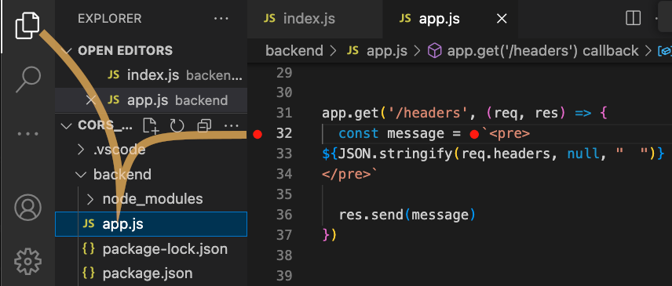
<small style="color:orange">Figure 9</small>  

44. Click on the Continue button in the debugger Control panel, as shown in Figure 10 below.

The debugger will finish executing all the remaining instructions that were triggered by the call to `cors()` and then stop just before executing the next instruction in your `app.js` script.

Node's `http` module does not make `res.headers` object directly accessible. The [`res._headers` has been deprecated since Node version 12](https://nodejs.org/api/deprecations.html#deprecations_dep0066_outgoingmessage_prototype_headers_outgoingmessage_prototype_headernames), so you can't trust it.

The best way to see the value of the `'Access-Control-Allow-Origin'` header is to use the Watch panel of the Debugger pane.

45.  Enter the expression `res.getHeaders()` into the Watch panel of the Debugger pane
46.  Press Enter
47.  Click on the disclosure arrow to show the individual key/value pairs.

Note that the property name is all in lowercase.


<small style="color:orange">Figure 10</small>  

You can also get the value of a `res.header` property directly if you know its name.

48. As in Figure 10 above, enter the expression `res.get("access-control-allow-origin")` in the Watch panel, and press Enter.

## H. Reviewing the response from the server

The adventure into the `cors` module is over. It's time to let Express deliver the response to the request.

49. Press the Step Over button in the debugger Control panel to create the `message` that is te be sent
50. Press the Continue button to execute `res.send(message)`

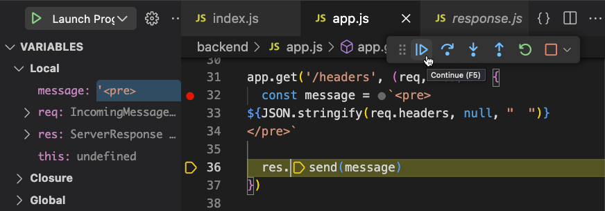
<small style="color:orange">Figure 11</small>  

51. Now look at the Console in your browser: all the `req.headers` are on display.
52. Select the Network tab and inspect the Headers for the last request in the list.

(Screenshot from Firefox)

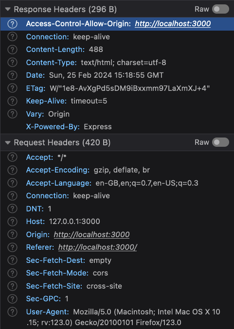
<small style="color:orange">Figure 12</small> 

The `"Access-Control-Allow-Origin"` response header has been set, and its value is `"http://localhost:3000"`. (Note that somewhere on the way, all the words in the header key have been given an initial capital letter again.) This is the origin of the site from which you made the request for data from `"http://127.0.0.1:3000"`, so all is good.

Or is it?

## I. What CORS does not do

You might be tempted to think that your server ***only*** sends the requested resource back to the browser if `"Access-Control-Allow-Origin"` response header has been correctly set. You might think that if CORS does not set the `"Access-Control-Allow-Origin"` header, or sets it to a value that is incompatible with `res.headers.origin`, then it will ***not*** send the requested resource.

But that's not what `cors` does. The `cors` module does one job, and it does it well. It sets (or does not set) the `"Access-Control-Allow-Origin"` response header. That's all.

The code in your `app.js` script explicitly says...
```javascript
res.send(message)
```
<small style="color:orange">Listing 21</small>  

... and so that's what your server does. Even when `cors` has indicated that `res.headers.origin` is not allowed.

The browser receives the resource, whether it is allowed to use it or not, and it is the _browser_ that checks if the value of `"Access-Control-Allow-Origin"` response header gives it permission to use the resource.

### Confirming the browser receives impermissible resources

53. Edit your `corsOptions` object, so that it generates a value of `false` for the `origin` property:

```javascript
const corsOptions = {
  origin: (origin, callback) => {
    console.log("origin:", origin);
    callback(null, false)
  }
}
```
<small style="color:orange">Listing 22</small>

54. Stop the debugger, by clicking on the Stop button in the debugger Control panel.
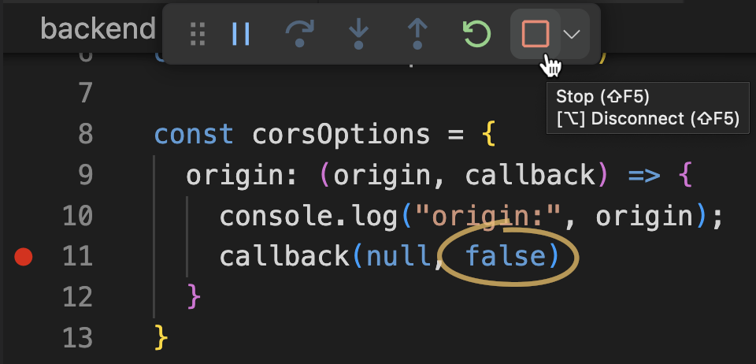
<small style="color:orange">Figure 13</small>  

55. Start your server normally, from the Terminal
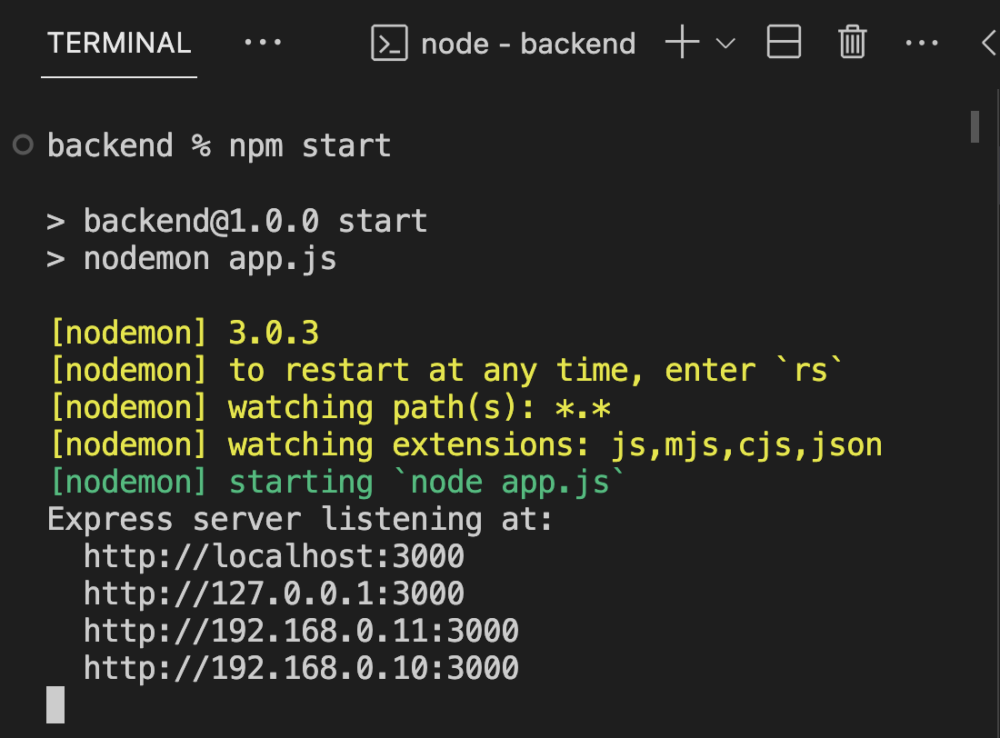  
<small style="color:orange">Figure 14</small>  

56. From your browser Console, run the same command that you ran before to fetch data from `127.0.0.1` (see Listing 8).

The console should give you the same Error that you saw in Listing 9 (or something like it, depending on which browser you are using.) The Cross-Origin Request is blocked because the `‘Access-Control-Allow-Origin’` response header is missing.

57. Now open the Network tab and look at the Response Headers for this last request. The value for Content-Length is _not zero_. Most probably it is exactly the same as for the last successful request (see Figure 12).
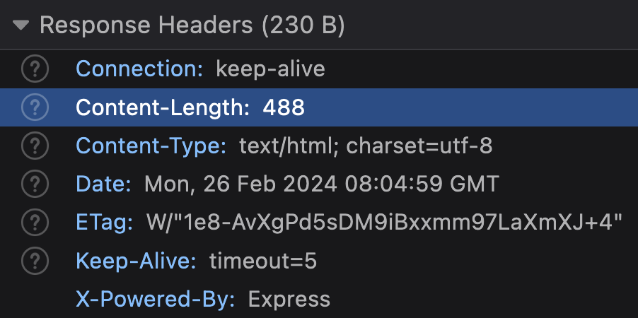

The `message` from your server _was_ delivered, even if the browser nobly refused to show it.

> **Aside**  
> If you are not convinced, you could use a tool like [WireShark](https://www.wireshark.org/), which is free and open-source, to read the packets returned by the server, and sure enough: the incoming message contains the `message` that your `app.js` script asked the server to send.
> 
> 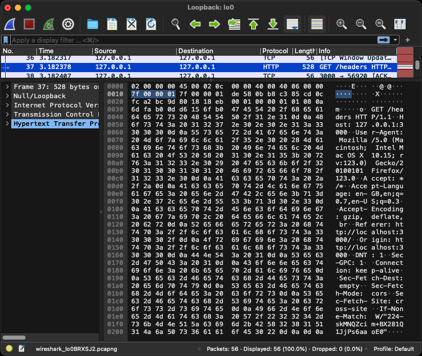
> <small style="color:orange">Figure 15</small>  

In other words, with its default settings, your Express server can waste both its CPU time and the bandwidth you pay for to send data across the Internet that only bad actors with rogue browser-like apps will be able to use.

## J. Ignoring Intruders

> **Note**  
> If you cloned the [GitHub repository](https://github.com/MERNCraft/CORS-backend), you can use `git checkout invitation-only` to apply the changes that are described below.

The solution is to check if the headers for the `res` object have been set to an acceptable value. The browser will give your client-side code access to the response from the server if `res.get("access-control-allow-origin")` is set to either `"*"` or to the value of `req.headers.origin`.

To check this:

58.  Add the following route to your `app.js` script:

```javascript
app.get('/invitation-only', (req, res) => {
  const origin = req.get("origin")
  console.log("origin:", origin);
  // `req.headers.origin`, sent from the browser, will
  // be either undefined or a string

  const allowed = res.get("access-control-allow-origin")
  // After treatment by `cors, the response header for
  // "access-control-allow-origin" will be one of:
  // - undefined
  // - "*"
  // - the same string as origin
  console.log("allowed:", allowed);

  // If a direct request is made from the browser's
  // address bar, ``req.headers.origin`` will be undefined,
  // so cors will not set the "access-control-allow-origin"
  // header. This means that `allowed` will also be
  // undefined, and therefore === `origin`, even though it
  // is not a string.
  const ok = (allowed === origin || allowed === "*")
  console.log("ok", ok)
  
  // Only use server CPU time and bandwidth if the request
  // came from a whitelisted origin. If not, send an empty
  // message.
  const message = ok
    ? "TODO: DATABASE STUFF TO GENERATE A REAL MESSAGE"
    : ""

  res.send(message)
})
```
<small style="color:orange">Listing 23</small>  

The last change you made to `corsOptions` (Listing 22) meant that the `"access-control-allow-origin"` response header was never set. You can change this so that only two server addresses are authorized:

59. Replace the current value for `corsOptions` with this:

```javascript
// const corsOptions = {
//   origin: (origin, callback) => {
//     console.log("origin:", origin);
//     callback(null, false)
//   }
// }
const corsOptions = {
  origin: [
    /^HTTP:\/\/LOCALHOST:/i,
    "http://127.0.0.1:3000"
  ]
}
```
<small style="color:orange">Listing 24</small>  

> **NOTE**  
> The first entry in the `origin` array is a Regular Expression. It will be used to check whether `res.headers.origin` starts with `HTTP://LOCALHOST:`, followed by a port number. The final `i` indicates that the match is case-<b><i>i</i></b>nsensitive, so it will also match `http://localhost:`.
> 
> The browser will always send `res.headers.origin` in lowercase. I wrote the Regular Expression in uppercase just to remind you that `cors` matches _string_ values (like `"http://127.0.0.1:3000"`) with case-<b><i>sensitive</i></b> matching, but Regular Expression matches can be case-<b><i>insensitive</i></b>.

Because you used `npm start` to tell `nodemon` to run your server in step 55, the server will be automatically relaunched after you save your changes.

60. In the browser Console, paste the code below (note the new URL for the `fetch` command) and press Enter:
```javascript
options = {"method": 'GET', "Content-Type": 'application/json'};
fetch('http://127.0.0.1:3000/invitation-only', options)
.then(res => res.text())
.then(text => console.log(text))
.catch(error => console.log("Error", error))
```
<small style="color:orange">Listing 25</small>  

This is a cross-origin request to the rout thate you have just created. The origin `'http://127.0.0.1:3000'` matches one of the values in the `origin` array in `corsOptions` so you should see the phrase "TODO: DATABASE STUFF TO GENERATE A REAL MESSAGE" logged in the Console.

And if you inspect the most recent request in the Headers tab of the Network pane, you'll see that the `Content-Length` for the response message is 47 characters:

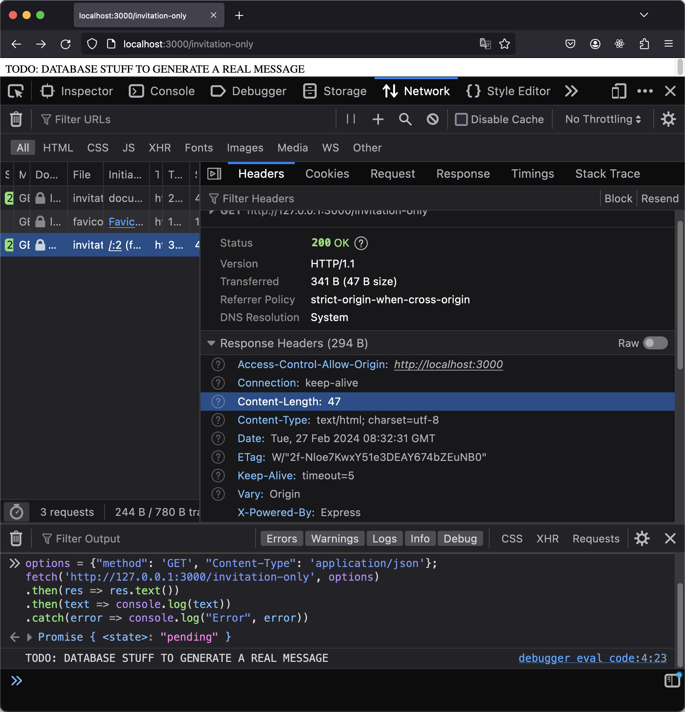
<small style="color:orange">Figure 16</small>  

### No content for an unauthorized site

When you restarted your server, you should have seen something like this logged into your Terminal pane:

```bash
Express server listening at:
  http://localhost:3000
  http://127.0.0.1:3000
  http://192.168.0.11:3000
```
<small style="color:orange">Listing 26</small>

Your `corsOptions` object explicitly authorizes sites at the loopback addresses `http://localhost:<anyport>` and `http://127.0.0.1:3000` to connect. If there are other links (like "http://192.168.0.11:3000" above), these represents origins that are not whitelisted by `corsOptions`.

61.  In the address bar of your browser, connect to `http://192.168.0.11:3000/invitation-only` (using your own non-loopback address instead of "192.168.0.11").
  
You should see `TODO: DATABASE STUFF TO GENERATE A REAL MESSAGE` in the browser window. This is because the request was made directly from the address bar, not from within the context of a page served by this site.

62. With the keyboard focus on the Console, press the Up arrow on your keyboard, so that the last command (Listing 25) is shown again.
63. Press the Enter key.

This time, as you might expect, the cross-origin request is rejected. If you inspect the most recent request in the Headers tab of the Network pane, you should see that the `Content-Length` of the response message was 0.

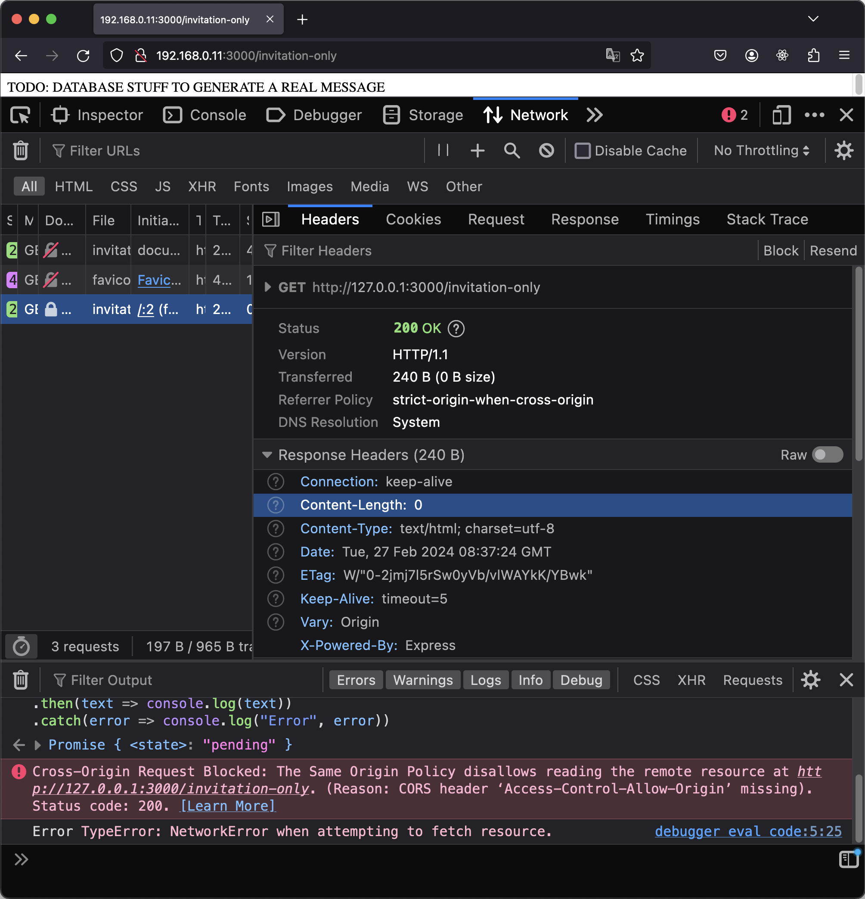
<small style="color:orange">Figure 17</small>  

In a real project, you won't be using a message like `"TODO: DATABASE STUFF TO GENERATE A REAL MESSAGE"`. In a real project, when an authorized request is received, your server might actually do some CPU intensive work calling a database and waiting for the response.

Using this technique to check whether the site that makes the request is authorized to receive a response, you can save CPU cycles and bandwidth, and prevent bad actors who sniff for packets with software like WireShark from gaining access to resources that they have no right to.

## `K. So what should you take away from this tutorial?

At the top level, you have seen:

* You can use `cors` Node module to add a header to the server's response to a request, which will tell the browser whether it has the right to use that response.
* By default, an Express server will send the response (and run all the code required to generate the response) _even if_ the site that sent the request is not authorized to use the response.
* In your route callback, you can check whether `cors` has set the `"access-control-allow-origin"` header in the response to a value that matches the `origin` in `req.headers`. If not, your route callback can simply return a blank message.
  
At a deeper level, you have discovered:
* Testing how a bad actor might try to access your site can help you improve the performance of your code
* You can simulate calls to an API from within a site by pasting code into the Developer Console and executing it.
* Your browser provides you with an immense amount of information about the data it requests and receives
* You can step through the code of your server with the debugger.
* Exploring the code used by a Node module is informative and empowering.
* When you encounter a problem in a big project, you can use a "Divide and Conquer" approach. You can take a step back and create a bare-bones project that deals specifically with the problem, so that all the other details of your big project don't get in the way of your understanding.
* As an example of such simplification, you can test cross-origin issues using a single server app on a single computer.

## Further Reading

[Will it CORS](https://httptoolkit.tech/will-it-cors/) asks you what you want to achieve with CORS and then gives you the code and describes the steps you need to achieve you goal.